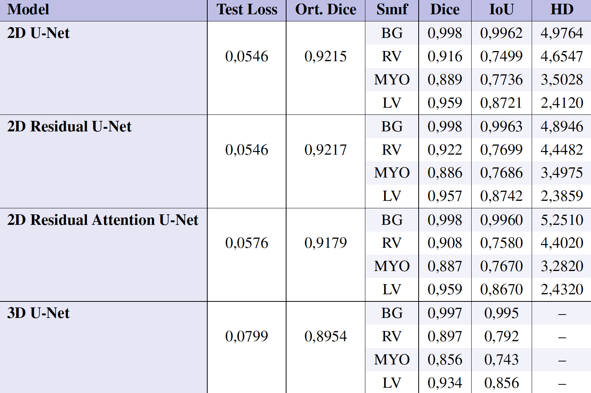
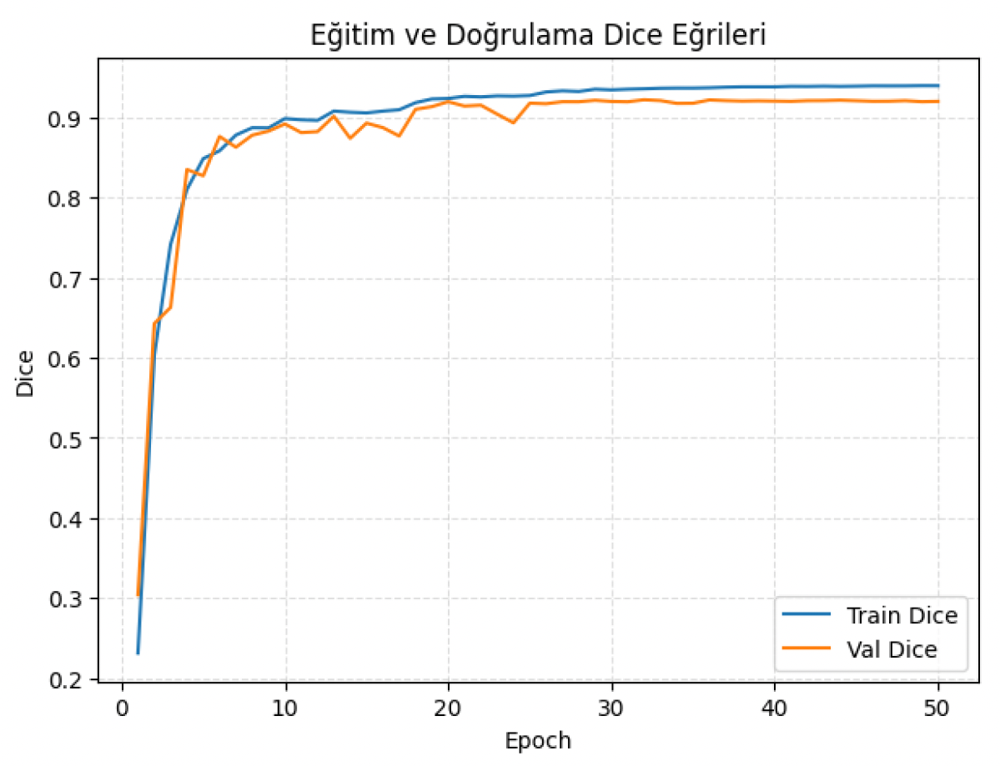
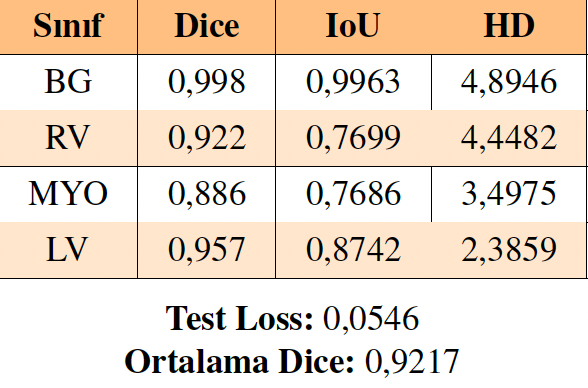
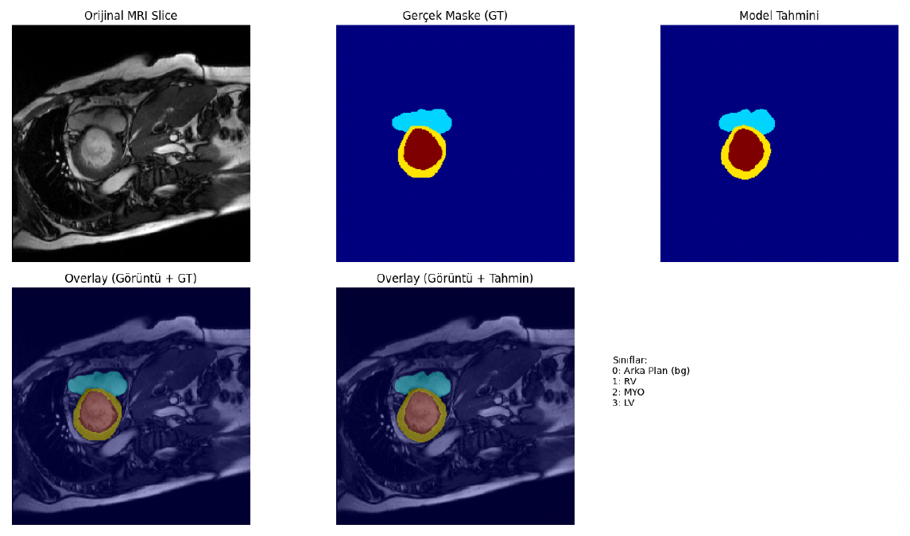
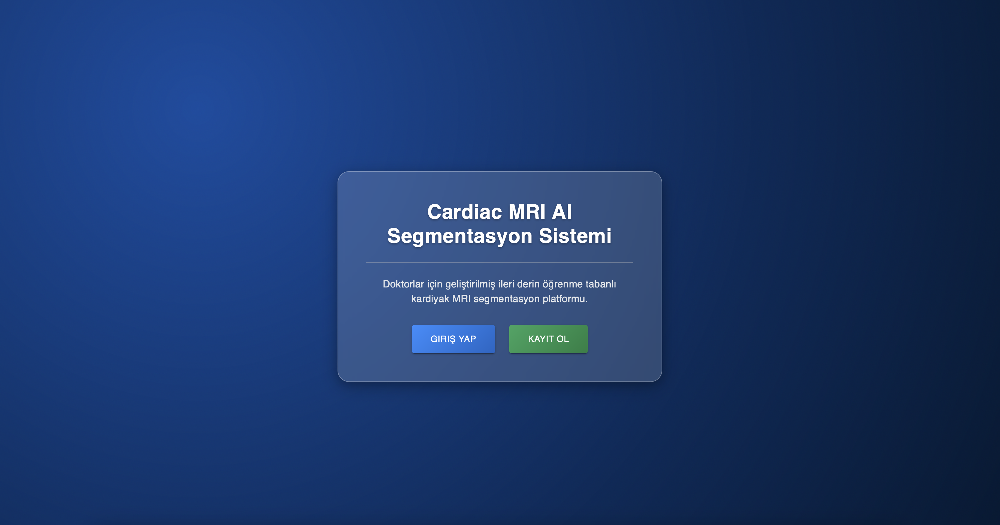
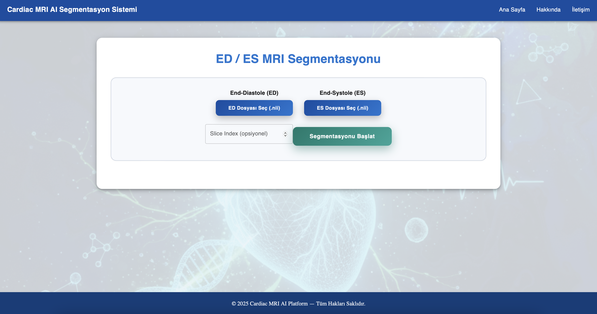
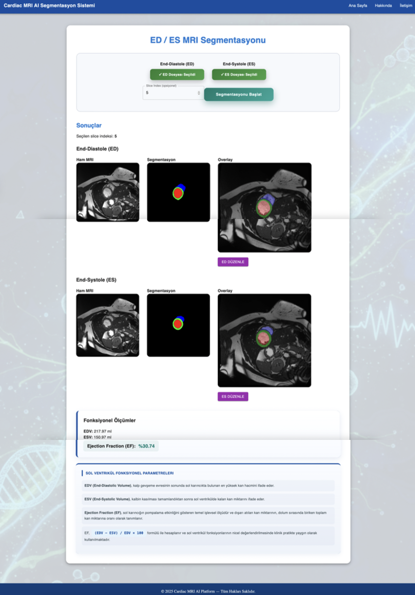

# Derin Öğrenme Tabanlı 3B Medikal Görüntü Segmentasyonu

Bu proje, kardiyak MR görüntülerinin otomatik segmentasyonu ve **EDV**, **ESV** ve **Ejeksiyon Fraksiyonu (EF)** gibi hacimsel kardiyak parametrelerin güvenilir biçimde hesaplanması için geliştirilmiş derin öğrenme tabanlı bir sistemi sunmaktadır.

Çalışma, manuel kardiyak MR segmentasyonuna bağlı zaman kaybını, operatör bağımlılığını ve tutarsızlıkları azaltmayı hedefleyen, klinik kullanıma uygun ve otomatik bir çözüm önermektedir.

---

## Problem Tanımı

**End-Diyastolik Hacim (EDV)**, **End-Sistolik Hacim (ESV)** ve **Ejeksiyon Fraksiyonu (EF)** gibi hacimsel kardiyak parametreler, kalp hastalıklarının değerlendirilmesinde temel klinik göstergelerdir.  
Bu parametrelerin doğruluğu, kardiyak boşluklar ve miyokardın MR görüntülerinde doğru şekilde segmentasyonuna doğrudan bağlıdır.

Mevcut klinik uygulamalarda segmentasyon çoğunlukla manuel olarak yapılmakta ve bu durum:
- Zaman verimsizliği  
- Operatöre bağımlılık  
- Gözlemciler arası ve gözlemci içi tutarsızlıklar  

gibi problemlere yol açmaktadır.

Bu nedenle hızlı, güvenilir ve otomatik kardiyak MR segmentasyon sistemlerine ihtiyaç duyulmaktadır.

---

## Amaç ve Hedefler

### Amaç
Kardiyak MR görüntülerinden kalp yapılarının otomatik olarak segmentasyonunu gerçekleştirerek, hacimsel kardiyak parametrelerin derin öğrenme tabanlı yöntemlerle güvenilir biçimde hesaplanmasını sağlamak.

### Hedefler
- **Sol Ventrikül (LV)**, **Sağ Ventrikül (RV)** ve **Miyokard (MYO)** yapılarının otomatik segmentasyonu
- **2D U-Net tabanlı** ve **3D U-Net** mimarilerinin performans karşılaştırmasının yapılması
- Manuel segmentasyona bağlı zaman kaybı ve kullanıcı bağımlılığının azaltılması
- Klinik kullanıma uygun, ölçeklenebilir bir yapay zekâ çözümünün geliştirilmesi

---

## Veri Seti

- **Veri Seti:** ACDC (MICCAI 2017)
- **Görüntü Türü:** Short-axis cine kardiyak MR
- **Fazlar:** End-Diyastol (ED) ve End-Sistol (ES)
- **Hasta Sayısı:** 150  
- **Klinik Gruplar:**
  - NOR (Normal): EF > %50
  - MINF (Miyokard enfarktüsü): EF < %40
  - DCM (Dilate kardiyomiyopati)
  - HCM (Hipertrofik kardiyomiyopati)
  - ARV (Sağ ventrikül anormallikleri)
- **Format:** NIfTI (.nii)
- **Etiketler:** Uzmanlar tarafından oluşturulmuş referans (ground truth) segmentasyon maskeleri (LV, RV, MYO)

---

## Ön İşleme ve Veri Artırma

### Ön İşleme
- Yeniden boyutlandırma ve mekânsal standartlaştırma
- Yoğunluk normalizasyonu
- Sınıf bazlı etiket kodlama  
  *(Arka plan, RV, MYO, LV)*

### Veri Artırma
- Yatay çevirme ve küçük açılı döndürmeler
- Ölçekleme ve öteleme
- Gauss gürültüsü ekleme
- Yoğunluk değişimleri ve bias field simülasyonları

  

  <em>Şekil: Orijinal kalp MR dilimi ve veri artırma sonrası elde edilen örnek görüntü.</em>

---

## Model Mimarileri

### Kullanılan Modeller
- **2D U-Net**
- **2D Residual U-Net (ResU-Net)**
- **2D Residual Attention U-Net (ResAttU-Net)**
- **3D U-Net**

### Eğitim Detayları
- Epoch sayısı: 50
- Optimizasyon algoritması: AdamW
- Kayıp fonksiyonu: Cross-Entropy + Soft Dice
- Öğrenme oranı planlayıcısı: ReduceLROnPlateau
- GPU destekli eğitim

---

## Değerlendirme Metrikleri

- **Dice Katsayısı**  
  Tahmin edilen segmentasyon ile gerçek segmentasyon arasındaki örtüşmeyi ölçer.
- **Intersection over Union (IoU)**  
  Bölgesel örtüşmeyi daha katı bir ölçütle değerlendirir.
- **Hausdorff Distance (HD)**  
  Segmentasyon sınırları arasındaki en büyük mesafeyi ölçerek sınır doğruluğunu değerlendirir.

---

## Kardiyak Fazlar ve Hacimsel Parametreler

- **End-Diyastol (ED):** Sol ventrikülün maksimum doluluk hacmine ulaştığı faz  
- **End-Sistol (ES):** Kasılma sonrası minimum hacme ulaşılan faz  

ED ve ES fazlarına ait segmentasyonlar kullanılarak:
- **EDV** ve **ESV** hesaplanır
- **Ejeksiyon Fraksiyonu (EF)**, kalbin pompalama fonksiyonunu gösteren temel klinik parametre olarak türetilir

---

## Sonuçlar

### Genel Başarım Karşılaştırması

  

  <em>
  Şekil: 2D U-Net, 2D Residual U-Net, 2D Residual Attention U-Net ve 3D U-Net
  mimarilerinin test seti üzerindeki segmentasyon performanslarının
  Dice, IoU ve Hausdorff Distance metrikleri açısından karşılaştırılması.
  </em>

### 2D Residual U-Net Modeli Eğitim Doğrulama Dice Eğrileri

  

  <em>
  Şekil: Eğitim ve doğrulama süreçlerinde elde edilen Dice katsayısı eğrileri.
  Modelin hızlı yakınsadığı ve eğitim–doğrulama eğrileri arasında belirgin
  bir sapma olmadığı gözlemlenmektedir.
  </em>

### 2D Residual U-Net Modeli Eğitim Doğrulama Loss Eğrileri

  

  <em>
  Şekil: Eğitim ve doğrulama sürecinde elde edilen kayıp (loss) eğrileri.
  Eğitim ve doğrulama kayıplarının birlikte ve kararlı biçimde azalması,
  modelin aşırı öğrenme (overfitting) göstermediğini ortaya koymaktadır.
  </em>

### 2D Residual U-Net Modeli Başarım Metrikleri

  

  <em>
  Şekil: 2D Residual U-Net modeli için test seti üzerinde elde edilen
  sınıf bazlı segmentasyon performans sonuçları. Her bir sınıf için
  Dice, IoU ve Hausdorff Distance metrikleri raporlanmıştır.
  </em>

### 2D Residual U-Net ile bir kalp MR diliminin orijinal, maske, tahmin ve örtüşme görselleri

  

  <em>
  Şekil: 2D Residual U-Net modeli kullanılarak elde edilen örnek segmentasyon sonucu.
  Üst sırada sırasıyla orijinal MR dilimi, gerçek maske (ground truth) ve model tahmini;
  alt sırada ise görüntü ile gerçek maske ve model tahmininin bindirilmiş (overlay)
  görünümleri sunulmaktadır.
  </em>

### Segmentasyon Performansı
- Ortalama Dice Skoru ≈ **0.92** (en iyi performans: 2D Residual U-Net)
- Ortalama IoU: **0.804**
- Ortalama Hausdorff Distance: **3.44**
- Tüm sınıflarda klinik açıdan kabul edilebilir örtüşme ve sınır doğruluğu elde edilmiştir

### Hacimsel Parametre Hataları
- EDV MAE: 7.31 ml
- ESV MAE: 5.80 ml
- EF MAE: %2.25

Sonuçlar, sistemin hacimsel kardiyak parametreleri düşük hata oranlarıyla ve klinik olarak kabul edilebilir doğrulukta tahmin edebildiğini göstermektedir.

---

## Uygulama Arayüzü

Geliştirilen web tabanlı klinik arayüz ile:
- ED ve ES kardiyak MR hacimleri yüklenebilir
- Otomatik segmentasyon gerçekleştirilebilir
- Orijinal görüntüler, maskeler ve örtüşme görselleri incelenebilir
- EDV, ESV, EF ve kalite kontrol (QC) sonuçları görüntülenebilir

Aşağıda sistemin arayüzüne ait bir ekran görüntüleri yer almaktadır:

  

  

  

  

  

  

  

  <em>
  Şekil: Geliştirilen web tabanlı klinik uygulama arayüzü.
  ED ve ES kardiyak MR hacimlerinin yüklenmesi, otomatik segmentasyon,
  maske ve bindirme (overlay) görselleştirmeleri ile EDV, ESV ve
  ejeksiyon fraksiyonu (EF) hesaplama sonuçları arayüz üzerinden
  kullanıcıya sunulmaktadır.
  </em>

---

## Gelecek Çalışmalar

- ED ve ES fazlarının otomatik olarak tespit edilmesi
- Segmentasyon sonrası manuel düzeltmelerin sisteme entegre edilmesi
- Hasta bazlı segmentasyon ve hacimsel sonuçların saklanması
- Farklı merkezlerden elde edilen verilerle genellenebilirliğin artırılması

---

## Geliştirici

**Zeynep Kaya**  
Lisans Bitirme Projesi – Derin Öğrenme Tabanlı 3B Medikal Görüntü Segmentasyonu

